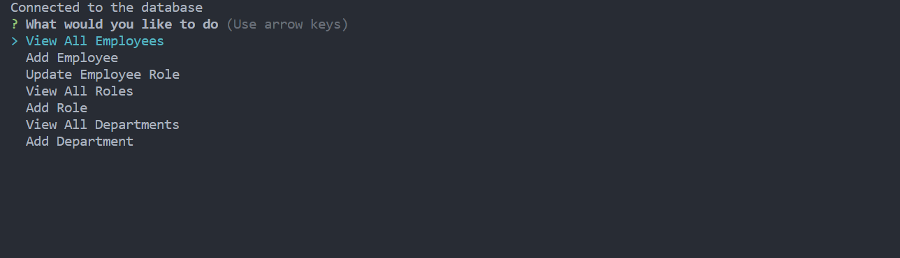
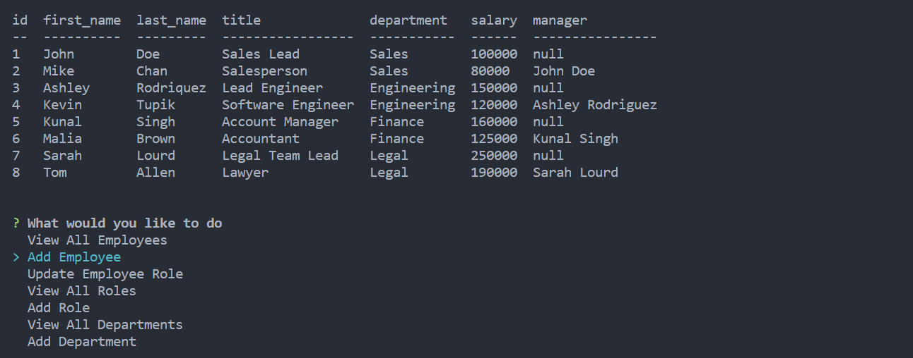
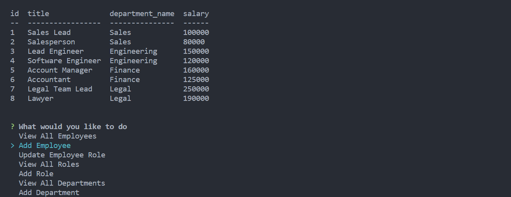
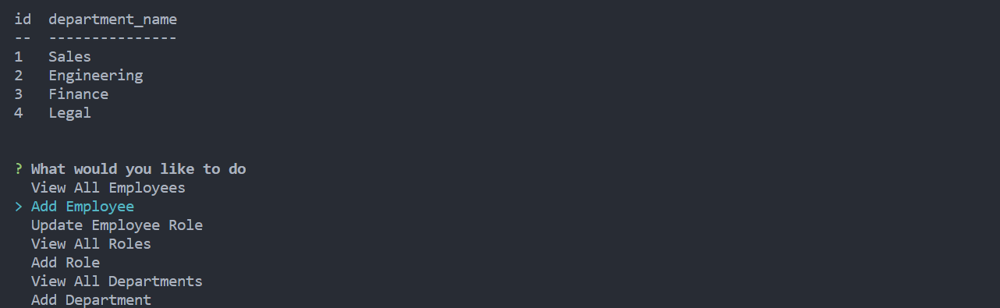

# MySQL-Employee-Tracker

## Description
This application is a command-line application that is used to view and update MySQL database tables. When the user runs this application, a list of options is given, 'View All Employees', 'Add Employee', 'Update Employee Role', 'View All Roles', 'Add Role', 'View All Departments' and 'Add Department'.

When the user selects 'View All Employees', the employees table is presented in the terminal.

When the user selects 'View All Roles', the roles table is presented in the terminal.

When the user selects 'View All Departments', the departments table is presented in the terminal.

When the user selects 'Add Employee', a series of questions are asked of the user in the terminal, and based off those answers, a new employee is added to the employees table.

When the user selects 'Add Role', a series of questions are asked of the user in the terminal, and based off those answers, a new role is added to the roles table.

When the user selects 'Add Department', a question is asked of the user in the terminal, and based off the answer, a new department is added to the departments table.

When the user selects 'Update Employee Role', a series of questions are asked of the user in the terminal, and based off those answers, the role of a certain employee is changed in the employees table.

## Screenshots

## Link to Walkthrough video
